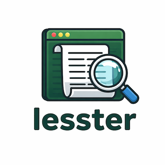

<p align="center">
  
</p>

# lesster

[](https://github.com/telatin/lesster/actions/workflows/ci.yml)

A `less`-like interactive text pager for the terminal, written in Nim. Use it as a standalone binary or embed it in your own Nim program.

## Install

```bash
nimble install lesster
```

Or build from source:

```bash
nim c --path:src -o:bin/lesster src/lesster_app.nim
```

## Usage

```bash
lesster file.txt
lesster -t "My Log" --scheme matrix file.log
cat output.txt | lesster -
```

**Options**

| Flag             | Description |
|------------------|-------------|
|     `-t`, `--title`  | Title shown in the title bar (default: filename) |
|     `-s`, `--scheme` | Colour theme: `default` `dark` `light` `matrix` `mono` `terminal` |
|   `--full-help`    | Open bundled full help in the TUI |
 
## Keybindings

| Key | Action |
|-----|--------|
| `Up` / `Down` | Scroll one line up / down |
| `PgUp` / `PgDn` | Scroll one page up / down |
| `Space` | Scroll one page down |
| `g` | Jump to top |
| `G` | Jump to bottom |
| `/` | Enter case-insensitive regex search mode |
| `n` / `N` | Next / previous match |
| `m` | Toggle minimal Markdown rendering |
| `s` | Toggle word-wrap |
| `Tab` | Cycle colour themes |
| `q` | Quit |

Markdown mode is auto-enabled when opening files ending in `.md`.

## Library API

```nim
import lesster

# Display an in-memory sequence of lines
viewText(lines: seq[string], title = "", themeName = "default")

# Display a file path, or "-" for stdin
viewFile(path: string, title = "", themeName = "default")
```

## License

MIT
